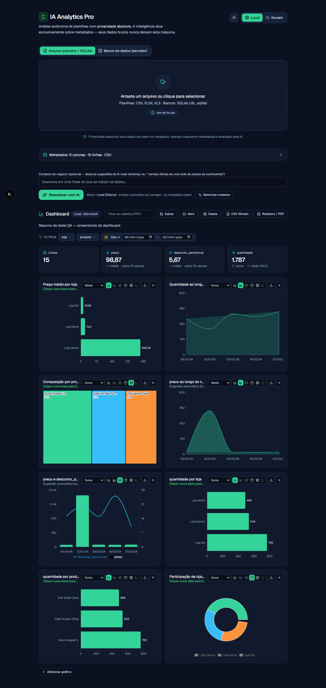

# IA Analytics Pro

Ferramenta fullstack de **análise autônoma de dados** e dashboards profissionais
para quem trabalha com dados (estilo BI empresarial), com um princípio
inegociável: **Privacidade Absoluta**. A Inteligência Artificial atua
exclusivamente sobre **metadados** (o esquema estrutural) — os dados brutos
**nunca** são transmitidos a serviços de terceiros.

> Arraste um arquivo ou conecte um banco, escolha **Local** ou **Nuvem**, e o
> resto a aplicação faz: extrai o esquema, monta o dashboard na hora e a IA
> enriquece as sugestões — tudo sem você digitar uma linha de configuração.

<!-- Substitua pela captura real quando disponível: docs/assets/screenshot-dashboard.png -->


_Interface de tela única, em pt-BR, com **tema escuro/claro comutável**; gráficos
auto-explicativos para negócios (ranking horizontal, rosca, tendência no tempo)._

**Fontes de dados:** planilhas (CSV/XLSX/XLS), bancos **SQLite** (.db/.sqlite,
lidos 100% no navegador) e bancos de servidor — **PostgreSQL, MySQL/MariaDB e
SQL Server** (via connection string, de preferência com usuário somente-leitura).

**Dashboard:** KPIs automáticos, filtros globais (categorias + intervalo de
datas), **drill-down** (clicar num gráfico filtra tudo), gráficos sugeridos pela
IA + heurística **+ construtor manual**, **agregação escolhível** (soma/média/
contagem/mín/máx), tabela ordenável/paginada, exportação **PNG** por gráfico,
**CSV filtrado** e **Relatório/PDF** com tema claro de impressão.

**Tipos de gráfico** (todos com números em pt-BR e datas DD/MM):

| Tipo | Para quê |
|------|----------|
| **Barras (ranking horizontal)** | Quem são os maiores/menores — rótulo de valor na ponta, top-N |
| **Área** | Tendência ao longo do tempo |
| **Combo (barras + linha, eixo duplo)** | Duas métricas de escalas diferentes juntas |
| **Pizza (rosca)** | Participação de poucas categorias (≤ 6) |
| **Treemap** | Composição por área quando há muitas categorias |
| **Dispersão** | Relação entre duas métricas numéricas (uso avançado) |

## Princípio: Dados vs. Metadados

```
Planilha (CSV/XLSX/XLS) · SQLite (.db) · Banco (Postgres/MySQL/SQL Server)
   │  leitura no cliente (arquivos) ou via servidor local (bancos)
   ▼
┌──────────────┐      só o esquema        ┌──────────────┐
│  Metadados   │ ───────────────────────► │  Motor de IA │  → JSON de gráficos
│ (esquema +   │   (nomes de coluna,      │ Local/Nuvem  │
│  estatísticas│    tipos, agregados)     └──────────────┘
│   anônimas)  │                                  │
└──────────────┘                                  ▼
        ▲                              ┌────────────────────────┐
        │                              │ Recharts funde o JSON  │
   Dados brutos ───────────────────────► da IA com os dados em  │
   (ficam só na memória do navegador)  │ memória (Fase D)       │
                                       └────────────────────────┘
```

A separação é garantida por `lib/data-parser.ts` (devolve só metadados) e por uma
**blindagem de payload** central em `lib/analysis.ts`, que rejeita qualquer corpo
de requisição contendo dados brutos (`rows`/`data`/`values`/`records`). Coberta
por testes (`npm test`). Detalhes em [docs/SECURITY.md](docs/SECURITY.md).

## Dois motores de IA (comutáveis na interface)

| Motor | Onde roda | Observação |
|-------|-----------|-----------|
| **Local (Ollama)** | Na máquina do usuário (`localhost:11434`) | 100% offline; modelo leve por padrão (`llama3.2:3b`). A página **detecta, instala, baixa modelo e até inicia o Ollama** sozinha (sem terminal). |
| **Nuvem (Gemini)** | API do Google (`@google/generative-ai`) | Saída JSON forçada; recomendado em modo pago para o não-uso dos dados em treino. |

Em ambos, **só o esquema** é enviado (poucas centenas de tokens por análise);
tabelas muito largas têm as colunas priorizadas/capadas antes de ir à IA.

## Persistência — reabrir sem reanalisar

Toda análise fica salva **localmente** (IndexedDB do navegador): a tela inicial
lista as **Análises recentes** e reabrir restaura as linhas + o dashboard + o
resultado da IA **instantaneamente, sem reprocessar nem chamar a IA de novo**.
Como tudo vive no dispositivo, a Privacidade Absoluta é preservada
(`lib/analysis-store.ts`).

## Como rodar

Requer **Node.js 20+**.

```bash
npm install
npm run dev        # http://localhost:3000
```

**Atalho (qualquer PC com Node):** dê dois cliques em **`IA Analytics Pro.cmd`**
— ele instala, builda, sobe o servidor e abre o navegador.

**Instalar como app (PWA):** abra no Chrome/Edge e use "Instalar" na barra de
endereço (PC) ou "Adicionar à tela inicial" (celular). _A instalação em celular
exige HTTPS — use um deploy ou um túnel (ex.: `ngrok http 3000`)._

**App desktop (Electron):**

```bash
npm run electron:dev   # janela de desenvolvimento (precisa do `npm run dev` rodando)
npm run dist           # gera o instalador em dist-desktop/ (baixa o Electron na 1ª vez)
```

No `.exe`, o motor Local funciona offline; para a Nuvem, coloque um `.env.local`
(com `GEMINI_API_KEY`) ao lado do executável.

## Configuração — `.env.local`

```dotenv
GEMINI_API_KEY=          # chave do Google AI Studio (motor Nuvem)
GEMINI_MODEL=gemini-2.5-flash
OLLAMA_BASE_URL=http://localhost:11434
OLLAMA_MODEL=llama3.2:3b
# ALLOW_REMOTE_DB=1      # só em deploy: libera /api/db/* fora do localhost
```

A `GEMINI_API_KEY` é lida **apenas server-side** e nunca chega ao navegador.

## Estrutura

```
app/
  api/analyze/{local,cloud}/       rotas de IA (recebem só metadados)
  api/db/{tables,rows}/            conectores de banco (introspecção + carga c/ teto)
  api/ollama/{models,pull,install,start}/  Ollama sem terminal (estado, baixar, instalar, iniciar)
  page.tsx                         tela única: fonte → motor → análise automática → dashboard
components/
  upload-zone · db-connect-panel · charts-wrapper · ollama-panel · recent-analyses · …
  dashboard/                       KPIs, filtros, tabela, cards, construtor e salvar/abrir
lib/
  data-parser     extração de metadados (+ leitura de linhas para o cliente)
  number-utils    conversão numérica sensível a locale (decimal por vírgula pt-BR)
  date-utils      datas ISO + DD/MM/AAAA ancoradas em UTC
  chart-data      preparo puro dos dados dos gráficos (agregações, série mensal)
  dashboard-utils filtros, KPIs, sugestões, ordenação e CSV (lógica pura testada)
  analysis-store  persistência local das análises (IndexedDB)
  sqlite-parser   SQLite no navegador (sql.js/WASM em public/)
  db-connectors   Postgres/MySQL/SQL Server (server-side, identificadores validados)
  analysis        blindagem de payload + normalização da resposta da IA
  prompt-builder · gpu-detect · server-guards · types
electron/         empacotamento desktop (servidor standalone embutido)
e2e/              testes Playwright (caminho de ouro)
docs/             ARCHITECTURE.md · SECURITY.md · adr/ (decisões de arquitetura)
```

## Testes

```bash
npm test           # Vitest — lógica pura: parsing, números pt-BR, agregações, privacidade
npm run test:e2e   # Playwright — upload → dashboard → persistência (navegador real)
```

Os testes de `lib/*.test.ts` blindam a invariante de privacidade (metadados
nunca contêm valores de célula) e a matemática das agregações/KPIs.

## Estendendo (preparado para o futuro)

- **Nova fonte de dados (SQL, n8n, API…):** estenda `BaseMetadataExtractor` em
  `lib/data-parser.ts` implementando `loadRawTable()` — toda fonte herda o mesmo
  isolamento de dados e o mesmo formato de metadados. Ver a skill
  `nova-fonte-dados` e [docs/ARCHITECTURE.md](docs/ARCHITECTURE.md).
- **Novo motor de IA:** crie uma rota em `app/api/analyze/<motor>/` reutilizando
  `validateMetadataPayload`/`normalizeCharts` (`lib/analysis.ts`) e o
  `SYSTEM_PROMPT` (`lib/prompt-builder.ts`).
- **Novo tipo de gráfico:** adicione ao union `ChartSpec` (`lib/types.ts`), trate
  o caso em `components/charts-wrapper.tsx` (`renderChart`), registre o botão em
  `chart-card.tsx`/`chart-builder.tsx` e, se fizer sentido, ensine `suggestCharts`
  (`lib/dashboard-utils.ts`). Reutilize `buildChartData` (`lib/chart-data.ts`).

## Scripts

| Script | O que faz |
|--------|-----------|
| `dev` | Servidor de desenvolvimento (Next.js) |
| `build` | Build de produção (saída standalone + assets) |
| `start` | Sobe o servidor standalone (produção) |
| `test` | Testes unitários (Vitest) |
| `test:e2e` | Testes end-to-end (Playwright) |
| `lint` | ESLint |
| `electron:dev` | App desktop em desenvolvimento |
| `dist` | Gera o instalador desktop |

## Documentação

- [docs/ARCHITECTURE.md](docs/ARCHITECTURE.md) — stack, fluxo de dados, decisões e estratégias.
- [docs/SECURITY.md](docs/SECURITY.md) — modelo de segurança e privacidade em detalhe.
- [docs/adr/](docs/adr/README.md) — **Registro de Decisões de Arquitetura** (ADRs):
  as escolhas estruturais âncora com contexto, alternativas e consequências.
- `CLAUDE.md` / `AGENTS.md` — guia de contribuição e invariantes do projeto.
